# AI Health Literature Review System

Automated daily monitoring and summarization of cutting-edge AI research applied to healthcare.

## Features

- **Automated Collection**: Fetches new papers from arXiv, PubMed, and conference sites daily
  - **arXiv**: 7 categories (cs.AI, cs.LG, cs.CL, cs.CY, q-bio, eess.AS, cs.CV) – up to 50/day
  - **PubMed**: Broad AI/health query across pubmed/pmc – up to 30/day
  - **Conferences**: NeurIPS proceedings (2020-2024) with full metadata extraction – up to 20/day
- **Intelligent Filtering**: Uses keyword matching and priority scoring to surface relevant papers
- **Multi-Provider Summarization**: Uses Gemini (2M free tokens) with fallbacks to HuggingFace and OpenRouter
- **Smart Fallback**: Automatically switches providers if one fails
- **Multiple Outputs**: Telegram, Email, Google Docs (cumulative knowledge base), local Markdown
- **Prioritization**: Scores papers by relevance, venue quality, and recency
- **Trend Analysis**: Identifies common keywords and research gaps across daily papers

## Quick Start

### 1. Install

```bash
# Clone / navigate to the project
cd ~/ai-health-lit-review

# Run installer
chmod +x install.sh
./install.sh

# Or manual setup:
python3 -m venv venv
source venv/bin/activate
pip install -r requirements.txt
mkdir -p data logs outputs/digests
cp .env.example .env  # then edit .env
```

**Note**: The installer sets up a daily cron job at 09:00. If you need a different time, edit your crontab (`crontab -e`).

### 2. Configure API Keys

Edit `.env` and add your API keys. At minimum:

```bash
# REQUIRED for summarization (2M tokens/month free)
GEMINI_API_KEY=AIzaSy...

# OPTIONAL but recommended for fallback
HUGGINGFACE_API_KEY=hf_...
OPENROUTER_API_KEY=sk-or-...

# OPTIONAL for outputs
TELEGRAM_BOT_TOKEN=...
TELEGRAM_CHAT_ID=...
SMTP_USER=...
SMTP_PASS=...
GOOGLE_CREDENTIALS_JSON={...}
```

**Get free API keys:**

- **Gemini**: Go to https://aistudio.google.com/ → "Get API Key" (2M tokens/month free)
- **HuggingFace**: https://huggingface.co/settings/tokens (30K tokens/month free)
- **OpenRouter**: https://openrouter.ai/ (account needed, various models)

### 3. Test

```bash
source venv/bin/activate

# Test summarizer with sample paper
python run_daily.py --test-summarize

# Test email
python run_daily.py --test-email

# Test Telegram
python run_daily.py --test-telegram

# Check database
python run_daily.py --stats

# Run full daily pipeline
python run_daily.py
```

### 4. Set up Cron (optional)

The installer already added a cron job (runs daily at 08:00). To modify:

```bash
crontab -e
```

Manual cron entry:
```
0 8 * * * cd /home/agent/ai-health-lit-review && source venv/bin/activate && python run_daily.py >> logs/cron_$(date +\%Y\%m\%d).log 2>&1
```

## Configuration

Edit `config.yaml` to customize:

- **Keywords**: Add/remove search terms
- **Sources**: Enable/disable arXiv, PubMed, conference sites
- **Max daily papers**: How many to summarize (default: 10)
- **Outputs**: Enable/disable Telegram, email, Google Docs
- **Priority venues**: Add your lab's target conferences/journals
- **Scoring weights**: Adjust what makes a paper "high priority"

## Outputs

### 1. Daily Markdown Digest
Saved to `outputs/digests/digest_YYYY-MM-DD.md`

### 2. Telegram Message
Formatted with Markdown, sent to configured channel. Includes:
- Top papers (priority 2)
- High priority papers (priority 1)
- Trends summary
- Links to full papers

### 3. Email Digest
Same content as Telegram, delivered to configured email.

### 4. Google Docs Knowledge Base
Appends daily digest to a cumulative document. Creates document if doesn't exist.
Useful for building a searchable knowledge base over time.

### 5. Local Database
SQLite database at `data/papers.db` tracks all collected papers, summaries, and status.
Tables:
- `papers`: All papers with metadata, scores, summaries
- `presentations`: Record of group presentations
- `daily_digests`: Log of sent digests

## Database Schema

### papers table
- `paper_id`: Unique ID (e.g., arxiv:2405.12345, pmid:123456)
- `source`: 'arxiv', 'pubmed', 'conference'
- `title`, `authors`, `abstract`, `url`, `pdf_url`
- `published_date`, `venue`, `doi`
- `keywords`: JSON array
- `score`: Relevance score (0-10)
- `priority`: 0=normal, 1=high, 2=top
- `summary`, `critique`, `methods`, `gaps`: Generated content
- `related_papers`: JSON array of connected paper IDs
- `processing_status`: 'pending', 'summarized', 'presented', 'archived'

## Scoring Algorithm

Papers are scored based on:

1. **Keyword matches** (+1 per keyword, max 5)
2. **Priority venue** (+3 if matches top conference/journal list)
3. **Priority terms** (+2 if contains "clinical trial", "real-world", "FDA", etc.)
4. **Recency** (+1 if published in last 7 days)
5. **Clinical relevance** (+1 if contains clinical terms)

Min score threshold (default 3.0) to be included in daily digest.

## Provider Fallback Chain

Summarization tries providers in order:

1. **Gemini** (primary) - 2M tokens/month free, high quality
2. **HuggingFace** (fallback) - Llama 3.3 70B, 30K tokens/month free
3. **OpenRouter** (tertiary) - Various models, may have costs

If a provider fails (API error, rate limit, etc.), automatically tries next.
Results are cached in database so failed papers can be retried later.

## Extending the System

### Adding New Sources

Create a new method in `collector.py`:
```python
def fetch_custom_source(self):
    # Your logic here
    papers = []
    # Process into standard format:
    # {
    #   'paper_id': 'custom:unique_id',
    #   'source': 'custom',
    #   'title': str,
    #   'authors': list,
    #   'abstract': str,
    #   'url': str,
    #   'published_date': 'YYYY-MM-DD',
    #   'venue': str,
    #   'score': float,
    #   ...
    # }
    return papers
```

Then add to `collect_all()` method.

### Customizing Summarization Prompt

Edit `_build_prompt()` in `summarizer.py` for each provider. The prompt structure is critical for consistent extraction.

### Adding New Outputs

Create a new method in `ReportGenerator`:
```python
def send_slack(self, message): ...
def post_to_notion(self, content): ...
def send_to_discord(self, webhook_url): ...
```

Then add to `generate_daily_digest()` workflow.

## Requirements

- Python 3.10+
- Internet connection (for API calls)
- API keys (at least one summarization provider)
- Optional: Telegram bot, SMTP, Google service account

## Troubleshooting

### "No providers available" error
- Check that `GEMINI_API_KEY` (or other keys) are set in `.env`
- Verify API key is valid (test with `--test-summarize`)
- Check logs in `logs/summarizer.log`

### Telegram not sending
- Verify `TELEGRAM_BOT_TOKEN` and `TELEGRAM_CHAT_ID` are set
- Bot must be admin in channel/group if posting to channel
- Check `logs/reporter.log`

### Email not sending
- Verify SMTP credentials (SMTP_USER, SMTP_PASS)
- For Gmail, use App Password (2FA enabled)
- Check spam folder
- See `logs/reporter.log`

### PubMed collection empty
- NCBI E-utilities may rate limit; consider adding email parameter
- Try reducing `max_results_per_day` in config
- Check `logs/collector.log`

### Gemini API errors
- Check your quota at AI Studio
- 2M tokens/month free, resets monthly
- If hitting rate limits, reduce `max_daily_papers`

## Project Structure

```
ai-health-lit-review/
├── collector.py          # arXiv, PubMed, conference fetchers
├── summarizer.py         # LLM providers (Gemini, HF, OpenRouter)
├── reporter.py           # Telegram, Email, Google Docs outputs
├── database.py           # SQLite management
├── daily.py              # Workflow orchestrator
├── run_daily.py          # CLI entry point
├── config.yaml           # Configuration
├── .env.example          # Environment template
├── requirements.txt      # Python dependencies
├── install.sh            # Setup script
└── README.md             # This file
```

## Architecture — Comment fonctionne le système

Ce diagramme montre l'ensemble du pipeline de collecte et d'analyse de papers, du scraping jusqu'à la revue de littérature PhD finale.

```mermaid
flowchart TB
    %% ═══════════════════════════════════════════════════════════════
    %% ENTRÉES — Les 5 thématiques PhD qui guident toute la collecte
    %% ═══════════════════════════════════════════════════════════════

    subgraph THEMES["📚 Les 5 Thématiques PhD <br/><small>(Research Questions — guident les queries de recherche)</small>"]
        direction TB
        T1["🔬 AI_EVAL_VALID<br/><small>Évaluation, validation, auditing, biais, fiabilité, explainabilité, sécurité</small>"]
        T2["🏛️ PARTICIPATORY_GOV<br/><small>Stakeholder engagement, gouvernance participative, accountability</small>"]
        T3["⚙️ ADAPTIVE_REGULATION<br/><small>Regulatory sandbox, FDA, cycle de vie réglementaire, itératif</small>"]
        T4["📊 EVIDENCE_IMPLEMENT<br/><small>Evidence-based, adoption, uptake, NASSS, implémentation</small>"]
        T5["🏥 CLINICAL_HEALTH_AI<br/><small>AI clinique, diagnostic, digital health, patient safety</small>"]
    end

    %% ═══════════════════════════════════════════════════════════════
    %% SOURCES — Où on scrape les papers
    %% ═══════════════════════════════════════════════════════════════

    subgraph SOURCES["🔍 Sources de données <br/><small>(APIs publiques — aucune API key nécessaire pour le scraping)</small>"]
        direction LR
        ARXIV["📄 arXiv.org<br/><small>API HTTP/XML<br/>Preprints cs.AI, cs.LG, cs.CL, q-bio...</small>"]
        PUBMED["📖 PubMed / NCBI<br/><small>E-utilities API<br/>Revues médicales et biomédicales</small>"]
        FUTURE["🚧 Sources futures (TODO)<br/><small>FAccT, AIES, ACM, IEEE Xplore<br/>Web of Science, Scopus, Google Scholar</small>"]
    end

    %% ═══════════════════════════════════════════════════════════════
    %% PIPELINE QUOTIDIEN
    %% ═══════════════════════════════════════════════════════════════

    subgraph PIPELINE["⚡ Pipeline quotidien — daily_pipeline.py <br/><small>(lancé chaque jour à 9h par cron)</small>"]
        direction TB

        C1["1️⃣ COLLECT<br/><small>Interroge arXiv API + PubMed API<br/>avec les 5 × 2 queries (10 queries/jour)<br/>→ récupère titre, abstract, auteurs, date, URL</small>"]
        C2["2️⃣ DEDUPLICATE<br/><small>Vérifie paper_id (arXiv ID, PMID)<br/>+ title fingerprint<br/>→ Ne garde que les papers vraiment nouveaux</small>"]
        C3["3️⃣ SCORE<br/><small>ranker.py applique la formule composite<br/>Theme×2 + Novelty + Recency + Venue + Methods<br/>→ Priority 3/2/1/0</small>"]
        C4["4️⃣ STORE<br/><small>Sauvegarde en JSON dans data/papers.json<br/>avec tous les metadata + score</small>"]
        C5["5️⃣ DIGEST<br/><small>Génère digest_YYYY-MM-DD.md<br/>avec résumé formaté par priorité<br/>Émojis 🔴🟡⚪ par importance</small>"]
        C6["6️⃣ AGGREGATE<br/><small>Met à jour ALL_DIGESTS.md<br/>(cumul de tous les digests)<br/>+ ALL_DIGESTS_SHORT.md</small>"]
        C7["7️⃣ PUSH<br/><small>git add → commit → push<br/>→ Arkoys/ai-health-lit-review<br/>(hébergé sur GitHub)</small>"]
    end

    %% Scoring details box
    subgraph SCORING_FORMULA["📐 Formule de Scoring — ranker.py"]
        direction LR
        SF1["<b>Theme_Score</b> = nb themes alignés × 2"]
        SF2["<b>Novelty</b> = 2 nouveau | 1 extension | 0.5 redondant"]
        SF3["<b>Recency</b> = 2 si ≤30j | 1 si ≤90j | 0.5 sinon"]
        SF4["<b>Venue</b> = 3 top-tier | 1.5 reconnu | 0 autre"]
        SF5["<b>Methods</b> = 2 empirique | 1.5 review | 1 framework | 0.5 opinion"]
    end

    %% Priority bands
    subgraph PRIORITY_BANDS["🎯 Bandes de Priorité"]
        direction LR
        P3["🔴 Priority 3<br/><small>Score ≥ 7<br/>Must Read</small>"]
        P2["🟡 Priority 2<br/><small>Score 4–6.9<br/>Important</small>"]
        P1["⚪ Priority 1<br/><small>Score 1.5–3.9<br/>Supplementary</small>"]
        P0["⚫ Priority 0<br/><small>Score < 1.5<br/>Low priority</small>"]
    end

    %% ═══════════════════════════════════════════════════════════════
    %% PIPELINE HEBDOMADAIRE
    %% ═══════════════════════════════════════════════════════════════

    subgraph WEEKLY["📅 Pipeline hebdomadaire — weekly_synthesis.py <br/><small>(lancé chaque vendredi à 11h par cron)</small>"]
        direction TB
        W1["1️⃣ AGGREGATE<br/><small>Collecte tous les digests<br/>des 7 derniers jours</small>"]
        W2["2️⃣ RE-RANK<br/><small>Re-score tous les papers<br/>de la semaine avec ranker.py</small>"]
        W3["3️⃣ TRENDS<br/><small>Génère la matrice<br/>4 semaines de tendances<br/>→ topic_trends/matrix_YYYY-MM-DD.md</small>"]
        W4["4️⃣ REPORT<br/><small>Synthèse hebdomadaire<br/>→ weekly/weekly_YYYY-MM-DD.md</small>"]
        W5["5️⃣ PUSH<br/><small>git push vers GitHub</small>"]
    end

    %% ═══════════════════════════════════════════════════════════════
    %% SORTIES / DELIVERABLES
    %% ═══════════════════════════════════════════════════════════════

    subgraph OUTPUTS["📦 Livrables produits"]
        direction LR
        O1["📄 Digests quotidiens<br/><small>outputs/digests/<br/>digest_YYYY-MM-DD.md</small>"]
        O2["📚 Cumul tous digests<br/><small>ALL_DIGESTS.md<br/>+ ALL_DIGESTS_SHORT.md</small>"]
        O3["📊 Rapport hebdomadaire<br/><small>outputs/weekly/<br/>weekly_YYYY-MM-DD.md</small>"]
        O4["📈 Matrice tendances<br/><small>outputs/topic_trends/<br/>matrix_YYYY-MM-DD.md</small>"]
        O5["🗄️ Base JSON<br/><small>data/papers.json<br/>(87 papers act.)</small>"]
    end

    %% ═══════════════════════════════════════════════════════════════
    %% OBJECTIF FINAL
    %% ═══════════════════════════════════════════════════════════════

    subgraph GOAL["🎓 Objectif PhD"]
        direction TB
        G1["📝 Rédaction de la Revue de Littérature<br/><small>Les papers collectés servent à écrire<br/>une revue de littérature PhD en santé/IA</small>"]
    end

    %% ═══════════════════════════════════════════════════════════════
    %% FLUX — connexions
    %% ═══════════════════════════════════════════════════════════════

    THEMES -->|"Query strings<br/>générées depuis"| SOURCES
    SOURCES -->|"HTTP/XML API calls"| C1
    THEMES -->|"scoring themes"| C3
    C1 --> C2 --> C3 --> C4 --> C5 --> C6 --> C7
    C3 --> SCORING_FORMULA
    SCORING_FORMULA --> PRIORITY_BANDS
    C5 -->|"digest du jour"| W1
    W1 --> W2 --> W3 --> W4 --> W5
    C7 -->|"push GitHub"| OUTPUTS
    W5 -->|"push GitHub"| OUTPUTS
    OUTPUTS -->|"matière première<br/>pour la revue"| GOAL

    %% Styling
    classDef themes fill:#e1f5fe,stroke:#01579b,stroke-width:2px,color:#01579b
    classDef sources fill:#f3e5f5,stroke:#4a148c,stroke-width:2px,color:#4a148c
    classDef pipeline fill:#fff3e0,stroke:#e65100,stroke-width:2px,color:#e65100
    classDef scoring fill:#e8f5e9,stroke:#1b5e20,stroke-width:2px,color:#1b5e20
    classDef priority fill:#fce4ec,stroke:#880e4f,stroke-width:2px,color:#880e4f
    classDef weekly fill:#fff8e1,stroke:#f57f17,stroke-width:2px,color:#f57f17
    classDef outputs fill:#e0f2f1,stroke:#004d40,stroke-width:2px,color:#004d40
    classDef goal fill:#f1f8e9,stroke:#33691e,stroke-width:3px,color:#33691e
    classDef future fill:#fafafa,stroke:#9e9e9e,stroke-width:2px,stroke-dasharray:5,color:#9e9e9e

    class T1,T2,T3,T4,T5 themes
    class ARXIV,PUBMED sources
    class FUTURE future
    class C1,C2,C3,C4,C5,C6,C7 pipeline
    class SF1,SF2,SF3,SF4,SF5 scoring
    class P3,P2,P1,P0 priority
    class W1,W2,W3,W4,W5 weekly
    class O1,O2,O3,O4,O5 outputs
    class G1 goal
```



### 🔍 Guide pas-à-pas du flux de données

**Étape 0 — Les thématiques (Research Questions)**
Avant de scraper quoi que ce soit, on définit 5 axes de recherche PhD. Chaque query de recherche est écrite pour cibler au moins l'un de ces thèmes.

**Étape 1 — Collection (Collect)**
`daily_pipeline.py` envoie des requêtes HTTP aux APIs :
- **arXiv** : `http://export.arxiv.org/api/query` — retourne du XML avec titre, abstract, auteurs, date
- **PubMed** : `https://eutils.ncbi.nlm.nih.gov/entrez/eutils/` — ESearch + EFetch en 2 temps (IDs puis détails)

**Étape 2 — Déduplication**
On vérifie si le paper existe déjà via :
- `paper_id` exact (ex: `2405.12345` pour arXiv, `pmid:41942541` pour PubMed)
- Title fingerprint (80 premiers caractères, sans ponctuation)

**Étape 3 — Scoring**
`ranker.py` analyse chaque paper avec une formule composite :
```
Score = Theme_Score(×2) + Novelty(2/1/0.5) + Recency(2/1/0.5) + Venue(3/1.5/0) + Methods(2/1.5/1/0.5)
```
→ Bands : 🔴 Priority 3 (≥7) | 🟡 Priority 2 (4-6.9) | ⚪ Priority 1 (1.5-3.9) | ⚫ Priority 0 (<1.5)

**Étape 4 — Stockage**
Les papers validés sont ajoutés à `data/papers.json` avec :
- Métadonnées complètes (titre, auteurs, abstract, URL, venue, date)
- Thèmes identifiés
- Score composite et priorité

**Étape 5 — Digest**
On génère un fichier markdown `digest_YYYY-MM-DD.md` par jour, structuré par priorité. Si plusieurs runs le même jour, on fait v2, v3...

**Étape 6 — Cumul**
`ALL_DIGESTS.md` est reconstruit à chaque run pour garder un fichier unique avec tout l'historique.

**Étape 7 — GitHub Push**
Tout est pushé sur `github.com/Arkoys/ai-health-lit-review` — accesible depuis n'importe où.

**Hebdomadaire** : Friday 11h → `weekly_synthesis.py` aggrège les 7 derniers jours, re-score, génère matrice de tendances + rapport hebdomadaire.

---

## License

This project is provided as-is for research purposes.

## Support

Issues and feature requests: [create an issue](#) (or contact your lab's tech lead)

---

**Built with ❤️ for the LiGHT lab and AI in health research**