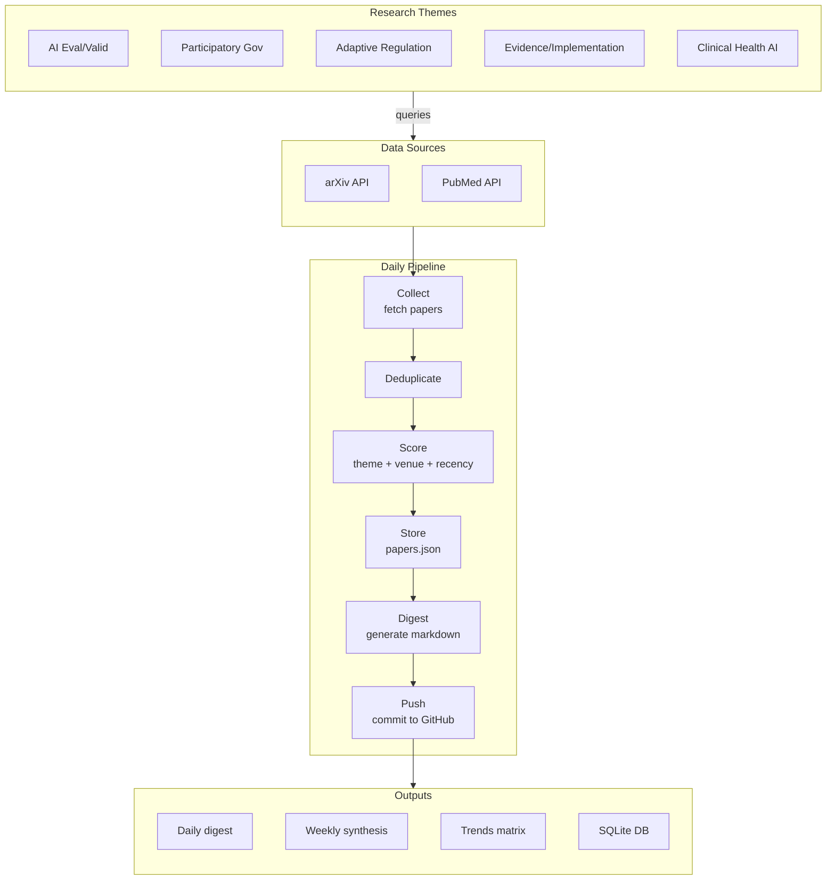

# AI Health Literature Review

Automated daily collection and summarization of AI + healthcare research papers.

## Setup

```bash
cd ~/ai-health-lit-review
./install.sh
cp .env.example .env
# Edit .env with your API keys (see below)
```

## API Keys

**Required** (free tier available):
- `GEMINI_API_KEY` — Get at https://aistudio.google.com/apikey (2M tokens/month free)

**Optional** (fallback providers):
- `HUGGINGFACE_API_KEY` — https://huggingface.co/settings/tokens
- `OPENROUTER_API_KEY` — https://openrouter.ai/

**Optional** (outputs):
- `TELEGRAM_BOT_TOKEN`, `TELEGRAM_CHAT_ID`
- `SMTP_USER`, `SMTP_PASS`
- `GOOGLE_CREDENTIALS_JSON`

## Run

```bash
source venv/bin/activate

# Test
python run_daily.py --test-summarize
python run_daily.py --stats

# Full pipeline
python run_daily.py
```

Daily cron runs at 08:00 (edit with `crontab -e`).

## Configure

Edit `config.yaml` to adjust:
- Search keywords
- Enabled sources (arXiv, PubMed)
- Max papers per day
- Output channels
- Priority venue list

## Outputs

| Output | Location |
|--------|----------|
| Daily digest | `outputs/digests/digest_YYYY-MM-DD.md` |
| Weekly digest | `outputs/weekly/weekly_YYYY-MM-DD.md` |
| Trends matrix | `outputs/topic_trends/matrix_YYYY-MM-DD.md` |
| Paper database | `data/papers.json` |
| SQLite DB | `data/papers.db` |

## Project Structure

```
ai-health-lit-review/
├── collector.py      # Fetch papers from arXiv, PubMed
├── summarizer.py     # LLM summarization
├── reporter.py       # Output delivery
├── database.py       # SQLite storage
├── run_daily.py      # CLI entry point
├── config.yaml       # Settings
└── requirements.txt
```

## Research Themes

Papers are scored and filtered around 5 themes:
1. AI Evaluation & Validation (bias, explainability, auditing)
2. Participatory Governance (stakeholder engagement, accountability)
3. Adaptive Regulation (FDA, regulatory sandboxes)
4. Evidence & Implementation (adoption, NASSS framework)
5. Clinical Health AI (diagnosis, digital health, patient safety)

## Architecture


